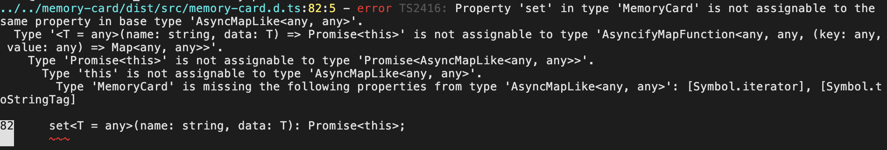
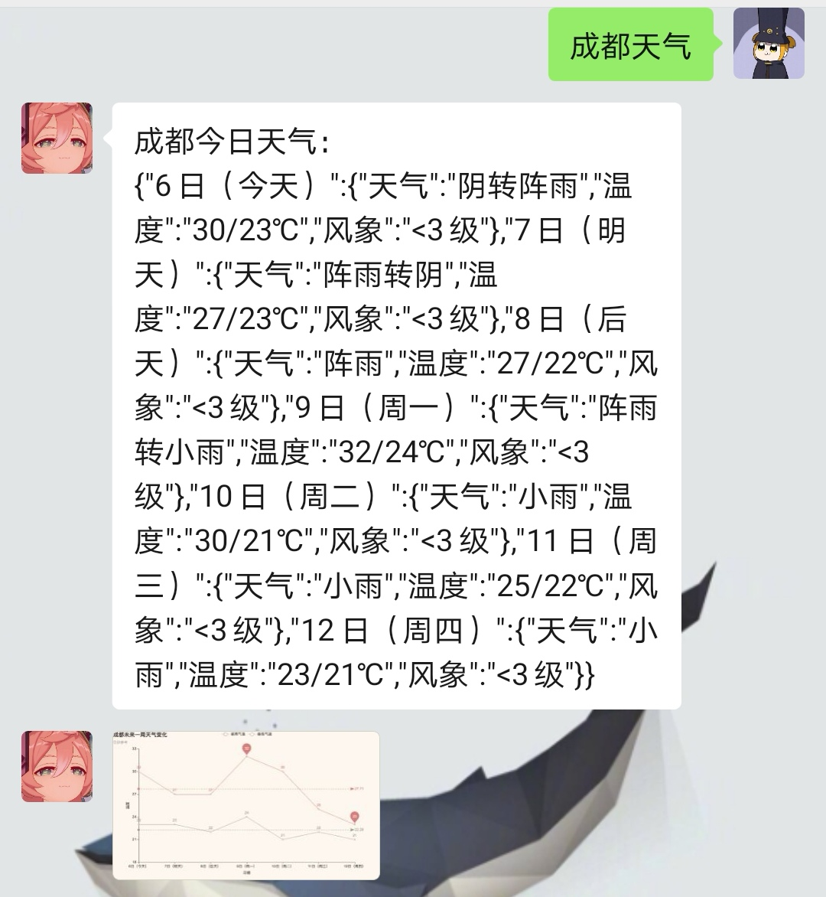

# WECHATY-PAIMONBOT

[](https://github.com/wechaty/wechaty) [](https://www.typescriptlang.org/) []() 

针对[wechaty-puppet-wechat](https://github.com/wechaty/wechaty-puppet-wechat)的功能实现，使用微信web协议的[UOS请求头](https://wechaty.js.org/2021/04/13/wechaty-uos-web/)，添加了额外的Python功能模块。

bot的功能逻辑代码使用Typescript编写，Python的功能模块代码使用Python编写

- [ ] PaimonBot
  - [x] 引入外部API实现智能对话
  - [x] 实现Bot和Python之间的动态调用
  - [x] 同时监控个人和群聊
  - [x] 多线程
  - [x] 针对特定语句的回复功能
    - [x] 图片
    - [x] 文字
    - [x] URL
  - [x] 将对话的问答模板从纯代码转为易用的`JSON`
    - [x] 用户编辑`JSON`文件的键值对以批量的创建问答
  - [x] 收发个人名片
  - [x] 收发小程序
  - [x] 收发视频
  - [ ] 发送群聊邀请
  - [x] @群成员
  - [x] 更改群名称
  - [ ] 群聊踢人
  - [ ] 自动通过好友申请
  - [ ] 添加表情包斗图
  - [x] 添加闲聊功能
  - [ ] 添加成语接龙
  - [ ] 其它功能
- [ ] PythonCode
  - [x] 天气爬虫
    - [x] 爬取一周的天气
    - [x] 以文字的形式回答提问者指定地区的天气
    - [x] 以图片的形式回答提问者指定地区的天气
      - [x] 多线程的爬取图片
    - [x] 多线程天气爬虫
    - [ ] 每日定时向指定的好友发送他们所在地的天气
  - [x] 成语接龙`keywor：成语接龙`
  - [x] 历史时刻`keywor：历史上的今天`
  - [x] 百度百科`keywor：百科全书或百科查询`
  - [ ] 谷歌翻译
  - [x] 表情包搜索`keywor：查表情包`
  - [x] 垃圾分类`keywor：垃圾分类`
  - [ ] 其它爬虫


## FEATURES

1. 使用门槛低，即使是完全没有编程经验的人也能使用
2. 不影响手机端的使用
3. 全平台运行（MacOS、Windows、Linux）
4. Python功能模块化，方便二次开发
5. 开箱即用，使用者不需要涉及代码编写，仅需要编辑想要的问答形式即可


## ChatShow


## GETTING STARTED

[Linux环境](#Linux)     |    [Windows环境](#win)     |     [macOS环境](#mac)


<h2  id="Linux">Linux环境</h2>

***NOTE：Linux配置应不低于1核1GB内存，推荐2核2GB内存***

1.安装`Node.js v14`

​		1）以 sudo 用户身份运行下面的命令，下载并执行 NodeSource 安装脚本：

```bash
curl -sL https://deb.nodesource.com/setup_14.x | sudo -E bash -
```

​		2）NodeSource 源启用成功后，安装 Node.js 和 npm:

```bash
sudo apt install nodejs
```

​		3）验证 Node.js 和 npm 是否正确安装。打印它们的版本号：

```bash
node -v
```


2.初始化root目录环境

```bash
npm init
```


3.从npm包管理库拉取必要依赖

```bash
npm i qrcode-terminal --save
npm i wechaty 
npm i wechaty-puppet-wechat --save
```


4.安装`wechaty-PaimonBot`

```bash
npm i wechaty-paimonbot
```


5.前往`root/node_modules`中的`wechaty-paimonbot`包内安装运行环境所必要的依赖

```
cd node_modules/wechaty-paimonbot/
npm install
```


6.安装`Typescript`和`ts-node`

```bash
npm install -g typescript
npm install -g ts-node
```


7.前往`/root/node_modules`中对部分依赖包中存在的错误进行修正

程序使用了大量的外部依赖，因此我们需要前往依赖包中对起代码进行部分修订

> 在`node_modules`中使用命令：`vim file-box/dist/src/file-box.d.ts`

将第2行中 `import http from 'http';` 修订为`import * as http from 'http';` 

> 在`node_modules`中使用命令：`vim file-box/dist/src/file-box.type.d.ts`

将第2行中 `import http from 'http';` 修订为`import * as http from 'http';` 

> 在`node_modules`中使用命令：`vim wechaty-puppet/dist/src/puppet.d.ts`

将第19行中的 `import QuickLru from 'quick-lru';`修订为 `import * as QuickLru from 'quick-lru';`


8.前往`root/node_modules/wechaty-paimonbot/node_modules`中对部分依赖包中存在的错误进行修正

> 在`wechaty-paimonbot/node_modules`使用命令：`vim file-box/dist/src/file-box.d.ts`

将第2行中 `import http from 'http';` 修订为`import * as http from 'http';` 

> 在`wechaty-paimonbot/node_modules`使用命令：`vim file-box/dist/src/file-box.type.d.ts`

将第2行中 `import http from 'http';` 修订为`import * as http from 'http';` 


9.安装剩余的依赖包

```bash
sudo apt-get install gconf-service libasound2 libatk1.0-0 libatk-bridge2.0-0 libc6 libcairo2 libcups2 libdbus-1-3 libexpat1 libfontconfig1 libgcc1 libgconf-2-4 libgdk-pixbuf2.0-0 libglib2.0-0 libgtk-3-0 libnspr4 libpango-1.0-0 libpangocairo-1.0-0 libstdc++6 libx11-6 libx11-xcb1 libxcb1 libxcomposite1 libxcursor1 libxdamage1 libxext6 libxfixes3 libxi6 libxrandr2 libxrender1 libxss1 libxtst6 ca-certificates fonts-liberation libappindicator1 libnss3 lsb-release xdg-utils wget

--------以上内容一次性复制，下面的命令单独执行--------

sudo apt-get install -y libgbm1
```


10.前往`root/node_modules`中的`wechaty-paimonbot`包内的`src`目录中执行：

```bash
tsc onMessage.ts
tsc PaimonBot.ts
```

如果**仅**出现这一项报错请忽略：


11.执行完第十步后，执行以下命令，启动bot：

```bash
ts-node PaimonBot.js
```

当屏幕中出现二维码需要扫描，通过后则bot完全启动


<h2 id="win">Windows环境</h2>

1.安装`Node.js v14`

​		前往[Node.js](https://nodejs.org/en/download/)官网下载Windows Installer并安装。安装完成后在`CMD`中使用`node -v`检查版本号，验证安装成功与否。


2.前往`C://User/「自己电脑的用户名下」`，在地址栏中删去的路径，输入`CMD`并回车在新的命令行窗口中，输入以下命令：	

```
npm init
```


3.从npm包管理库拉取必要依赖（依旧在刚刚打开的命令行窗口中）

```bash
npm i qrcode-terminal --save
npm i wechaty 
npm i wechaty-puppet-wechat --save
```


4.安装`wechaty-PaimonBot`（依旧在刚刚打开的命令行窗口中）

```bash
npm i wechaty-paimonbot
```


5.前往`C://User/「自己电脑的用户名下」/node_modules`中的`wechaty-paimonbot`包内安装运行环境所必要的依赖

```
cd node_modules/wechaty-paimonbot/
npm install
```


6.安装`Typescript`和`ts-node`

```bash
npm install -g typescript
npm install -g ts-node
```


7.前往`wechaty-paimonbot/node_modules`中对部分依赖包中存在的错误进行修正

> 在`wechaty-paimonbot/node_modules`使用命令：`vim file-box/dist/src/file-box.d.ts`

将第2行中 `import http from 'http';` 修订为`import * as http from 'http';` 

> 在`wechaty-paimonbot/node_modules`使用命令：`vim file-box/dist/src/file-box.type.d.ts`

将第2行中 `import http from 'http';` 修订为`import * as http from 'http';` 


8.前往`C://User/「自己电脑的用户名下」/node_modules`中对部分依赖包中存在的错误进行修正

程序使用了大量的外部依赖，因此我们需要前往依赖包中对起代码进行部分修订

> 在`node_modules`中使用命令：`vim file-box/dist/src/file-box.d.ts`

将第2行中 `import http from 'http';` 修订为`import * as http from 'http';` 

> 在`node_modules`中使用命令：`vim file-box/dist/src/file-box.type.d.ts`

将第2行中 `import http from 'http';` 修订为`import * as http from 'http';` 

> 在`node_modules`中使用命令：`vim wechaty-puppet/dist/src/puppet.d.ts`

将第19行中的 `import QuickLru from 'quick-lru';`修订为 `import * as QuickLru from 'quick-lru';`


9.前往`C://User/「自己电脑的用户名下」/node_modules`中的`wechaty-paimonbot`包内的`src`目录中执行：

```bash
tsc onMessage.ts
tsc PaimonBot.ts
```

如果**仅**出现这一项报错请忽略：


10.执行完第九步后，执行以下命令，启动bot：

```bash
ts-node PaimonBot.js
```

当屏幕中出现二维码需要扫描，通过后则bot完全启动


<h2 id="mac">macOS环境</h2>


1.安装`Node.js v14`

​		前往[Node.js](https://nodejs.org/en/download/)官网下载macOS Installer并安装。安装完成后在`terminal`中使用`node -v`检查版本号，验证安装成功与否。


2.在`	terminal`输入以下命令并回车，会初始化配置文件，只需要一路的回车确认就行	

```
npm init
```


3.从npm包管理库拉取必要依赖（依旧在刚刚打开的`terminal`窗口中）

```bash
npm i qrcode-terminal --save
npm i wechaty 
npm i wechaty-puppet-wechat --save
```


4.安装`wechaty-PaimonBot`（依旧在刚刚打开的`terminal`窗口中）

```bash
npm i wechaty-paimonbot
```


5.前往`/User/「自己电脑的用户名下」/node_modules`中的`wechaty-paimonbot`包内安装运行环境所必要的依赖

```
cd node_modules/wechaty-paimonbot/
npm install
```


6.安装`Typescript`和`ts-node`

```bash
npm install -g typescript
npm install -g ts-node
```


7.前往`wechaty-paimonbot/node_modules`中对部分依赖包中存在的错误进行修正

> 在`wechaty-paimonbot/node_modules`使用命令：`vim file-box/dist/src/file-box.d.ts`

将第2行中 `import http from 'http';` 修订为`import * as http from 'http';` 

> 在`wechaty-paimonbot/node_modules`使用命令：`vim file-box/dist/src/file-box.type.d.ts`

将第2行中 `import http from 'http';` 修订为`import * as http from 'http';` 


8.前往`/User/「自己电脑的用户名下」/node_modules`中对部分依赖包中存在的错误进行修正

程序使用了大量的外部依赖，因此我们需要前往依赖包中对起代码进行部分修订

> 在`node_modules`中使用命令：`vim file-box/dist/src/file-box.d.ts`

将第2行中 `import http from 'http';` 修订为`import * as http from 'http';` 

> 在`node_modules`中使用命令：`vim file-box/dist/src/file-box.type.d.ts`

将第2行中 `import http from 'http';` 修订为`import * as http from 'http';` 

> 在`node_modules`中使用命令：`vim wechaty-puppet/dist/src/puppet.d.ts`

将第19行中的 `import QuickLru from 'quick-lru';`修订为 `import * as QuickLru from 'quick-lru';`


9.前往`/User/「自己电脑的用户名下」/node_modules`中的`wechaty-paimonbot`包内的`src`目录中执行：

```bash
tsc onMessage.ts
tsc PaimonBot.ts
```

如果**仅**出现这一项报错请忽略：


10.执行完第九步后，执行以下命令，启动bot：

```bash
ts-node PaimonBot.js
```

当屏幕中出现二维码需要扫描，通过后则bot完全启动


## 启用Python功能模块

**NOTE：不建议Linux端使用天气的可视化模块，可能会出现未知错误。win和mac端需要安装[chromium驱动](https://sites.google.com/a/chromium.org/chromedriver/downloads)，需要安装在`/usr/bin` or `/usr/local/bin`路径下**

进入`wechaty-PaimonBot/PyMode/WeatherCrawlMode`中，运行以下命令python依赖包：

```python
pip install -r requirements.txt  -i https://pypi.tuna.tsinghua.edu.cn/simple
```

进入`wechaty-PaimonBot/PyMode/WeatherCrawlMode/src`中，执行：

```
python3 main.py
```

启动成功


## 使用说明

位于`wechaty-PaimonBot`文件夹下存在一个名为`json`的文件夹

进入`json`文件夹后，有`friendAndRoomInfo`和`QA`这两个json文件


> `friendAndRoomInfo.json`

文件内结构如下：

`myName`后的双引号内填入使用机器人的微信账户的名称

`room_Keys`内以`“群聊名称”:true`的形式填入需要机器人运作的群聊

`friend_Keys`内以`“朋友的微信名称”:true`的形式填入需要机器人关注的的朋友（名称为账户名称，非备注名称）


> `QA.json`

文件内结构如下：

以`“问题”:“回答”`的形式，填入任意数量的问答，机器人会自动匹配问题并自动回复答案


> 天气模块的使用

对于个人聊天，可以直接使用`地点+天气`的问答形式获取当地的天气，已经天气的可视化图片。如果地点不存，则会提示这个地点是错误的。


<h3>在群聊中的任何对话都需要`@`机器人才能触发</h3>


<h3>对于任何非天气的问话，机器人都会使用`QA.json`文件中的答案进行回答</h3>


## Q&A


## VERSION

v2.2.0（2021.8.10）新增了5个python模块

v2.1.0（2021.8.7）bug修复

<h3>v2.0.0（2021.8.6）</h3>

​			重构了整个`onMessage模块`，增加了两个供用户使用的json文件，降低了使用门槛。即使完全没有编程经验的使用者也可以使用所有功能了。

​			增加了天气爬虫的多线程功能

v1.1.0（2021.8.5）多线程爬虫和多线程绘图

v1.0.3（2021.8.5）完善了所有的教程

v1.0.2（2021.8.4）增加了一些必要的更新

v1.0.1 （2021.8.4）更新了getting started

<h3>v1.0.0（2021.8.4）</h3>

​			 初次提交


## LICENSE & DISCLAIMERS

-  Apache-2.0 License
- 本软件使用了GitHub上的开源项目[WECHATY-PUPPET-WECHAT](https://github.com/wechaty/wechaty-puppet-wechat)
- 请合理使用，使用者应遵守相应的法律法规，一切法律问题及后果与作者无关，***Don't be evil***

